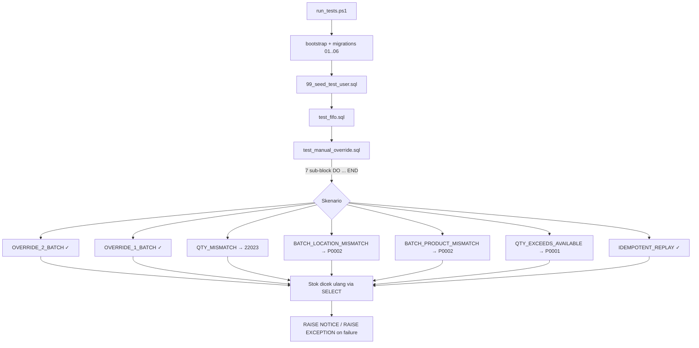

# Design Document — Manual Override Batch

## Overview

Sasaran spec ini adalah menambah **deterministic SQL test** dan **dokumentasi** untuk cabang `Manual_Override` pada `transaction_create` (`supabase/migrations/03_functions_fifo.sql`). Tidak ada perubahan API publik. Implementasi RPC sudah memenuhi keempat aturan validasi yang ditargetkan; spec ini menguncinya secara mekanis lewat `psql` agar regresi tertangkap di `run_tests.ps1`.

Karena lingkup utamanya adalah test SQL + edit dokumentasi (bukan algoritma baru, parser, atau transformasi data), bagian *Correctness Properties* tetap kami tulis—tetapi cakupannya kecil dan fokus pada **invariant stok** yang harus dijaga oleh RPC saat override dipakai.

## Architecture

### Diagram alur test



### Pemilihan lokasi & produk test

| Tujuan | Pilihan | Alasan |
| --- | --- | --- |
| Test_Location | `Outlet Dago` | Tidak dipakai `test_fifo.sql` (yang memakai `Gudang Pusat` & `Outlet Pamulang`), juga tidak punya batch dari seed (`06_seed_data.sql` hanya mengisi Gudang Pusat). |
| Lokasi pengganggu | `Gudang Pusat` | Dipakai untuk skenario *batch dari lokasi berbeda* (Acceptance 1.5). |
| Test_Product_A | `SKU-001` | Sudah ada di seed produk. Stok awal di Gudang Pusat 30+50+40 (untuk skenario 1.5). |
| Test_Product_B | `SKU-002` | Untuk skenario *batch dari produk berbeda* (Acceptance 1.6) — kita siapkan batch SKU-002 di Outlet Dago di sisi persiapan. |
| Tanggal produksi test | `current_date - 30, -20, -10` | Tidak bertabrakan dengan seed yang memakai `-5, -3, -1`. |

### Strategi isolasi state

- Setiap sub-skenario diawali blok persiapan idempotent: `INSERT ... ON CONFLICT (product_id, location_id, production_date) DO UPDATE SET qty_available = EXCLUDED.qty_available`. Ini sesuai dengan UNIQUE constraint di `inventory_batches` (`01_schema.sql`).
- Setiap sub-skenario menyimpan snapshot `qty_available` ke variabel lokal (mis. `v_qty_b1_before`) sebelum panggilan RPC, lalu membandingkannya setelah panggilan.
- Idempotent replay (skenario 7) menggunakan `client_uuid` baru tiap rerun (`gen_random_uuid()`), jadi run berikutnya tidak terganggu oleh row dari run sebelumnya.

### Strategi assertion

Karena lingkungan test adalah Postgres polos (tidak ada `pgTAP`), kita pakai pola yang sudah hidup di `test_fifo.sql`:

- **Sukses**: `RAISE NOTICE` + assert via `IF ... THEN RAISE EXCEPTION 'ASSERTION FAILED: ...'`. RPC akan menggagalkan psql (`ON_ERROR_STOP=1` di `run_tests.ps1`) saat `RAISE EXCEPTION` di-throw dari DO block.
- **Error yang diharapkan**: bungkus panggilan RPC di sub-block `BEGIN ... EXCEPTION WHEN sqlstate '...' THEN ... ELSE ... END`. Jika sqlstate yang ter-raise tidak sesuai, sub-block menggemakan ulang error dan psql gagal. Jika tidak ada error sama sekali, kita raise eksplisit `'ASSERTION FAILED: expected sqlstate X but RPC succeeded'`.

### Modifikasi `run_tests.ps1`

Tambahkan satu baris setelah `Invoke-Sql (Join-Path $tst "test_fifo.sql")`:

```powershell
Invoke-Sql (Join-Path $tst "test_manual_override.sql")
```

Tidak ada perubahan parameter atau struktur lain.

### Modifikasi `docs/API.md`

Tambah dua hal di section `transaction_create`:

1. Daftar 4 aturan validasi `Manual_Override` di bawah blok JSON `p_items`.
2. Tabel matriks error spesifik untuk `transaction_create` (lebih detail dari tabel umum di bagian "Konvensi Error").
3. Kalimat eksplisit bahwa idempotensi `p_client_uuid` tetap berlaku saat override dipakai.

## Components and Interfaces

### `supabase/tests/test_manual_override.sql` (baru)

Satu file SQL berisi satu DO block utama yang memuat 7 sub-blok skenario. Pseudocode struktur:

```sql
do $$
declare
  v_outlet_dago uuid;
  v_gudang      uuid;
  v_pa          uuid;       -- product A (SKU-001)
  v_pb          uuid;       -- product B (SKU-002)
  v_admin       uuid;
  v_b1 uuid; v_b2 uuid; v_b3 uuid;     -- batch di Outlet Dago, product A
  v_b_pb uuid;                          -- batch di Outlet Dago, product B
  v_b_gudang uuid;                      -- batch di Gudang Pusat, product A
  v_qty_before  integer;
  v_qty_after   integer;
  v_tx          jsonb;
  v_cid         uuid;
begin
  -- LOOKUP master + early-return jika user kosong
  -- PERSIAPAN BATCH (idempotent via ON CONFLICT)

  -- SCENARIO 1: OVERRIDE_2_BATCH (sukses)
  -- SCENARIO 2: OVERRIDE_1_BATCH (sukses)
  -- SCENARIO 3: QTY_MISMATCH (22023)
  -- SCENARIO 4: BATCH_LOCATION_MISMATCH (P0002)
  -- SCENARIO 5: BATCH_PRODUCT_MISMATCH (P0002)
  -- SCENARIO 6: QTY_EXCEEDS_AVAILABLE (P0001)
  -- SCENARIO 7: IDEMPOTENT_REPLAY
end$$;
```

#### Persiapan batch (deterministic)

| Variabel | Lokasi | Produk | `production_date` | `qty_available` awal |
| --- | --- | --- | --- | --- |
| `v_b1` | Outlet Dago | SKU-001 | `current_date - 30` | 20 |
| `v_b2` | Outlet Dago | SKU-001 | `current_date - 20` | 30 |
| `v_b3` | Outlet Dago | SKU-001 | `current_date - 10` | 50 |
| `v_b_pb` | Outlet Dago | SKU-002 | `current_date - 15` | 25 |
| `v_b_gudang` | Gudang Pusat | SKU-001 | dari seed (offset `-5`) | bergantung `test_fifo.sql` (≥ 0) |

`v_b_gudang` **dibaca**, bukan di-`upsert`, karena seed sudah membuat baris `(SKU-001, Gudang Pusat, current_date-5)`. Test ini hanya butuh batch yang ada di lokasi berbeda untuk skenario 4; nilai `qty_available` tidak dimodifikasi.

#### Mapping skenario → assertion

| # | Nama | Payload `p_items[0]` | Hasil yang diharapkan | Assertion stok |
| --- | --- | --- | --- | --- |
| 1 | OVERRIDE_2_BATCH | `qty=15`, `override=[{v_b1,5},{v_b2,10}]` | `idempotent_replay=false`, transaction_id non-null | `v_b1: 20→15`, `v_b2: 30→20`, `v_b3: 50→50` |
| 2 | OVERRIDE_1_BATCH | `qty=7`, `override=[{v_b3,7}]` | sukses | `v_b3: 50→43` |
| 3 | QTY_MISMATCH | `qty=10`, `override=[{v_b1,4},{v_b2,4}]` (total 8) | sqlstate `22023` | `v_b1, v_b2` tidak berubah dari snapshot |
| 4 | BATCH_LOCATION_MISMATCH | `p_location_id=Outlet Dago`, `qty=3`, `override=[{v_b_gudang,3}]` | sqlstate `P0002` | `v_b_gudang` tidak berubah dari snapshot |
| 5 | BATCH_PRODUCT_MISMATCH | `product_id=SKU-001`, `qty=2`, `override=[{v_b_pb,2}]` (batch SKU-002) | sqlstate `P0002` | `v_b_pb` tidak berubah |
| 6 | QTY_EXCEEDS_AVAILABLE | `qty=99`, `override=[{v_b1,99}]` setelah skenario 1 (sisa 15) | sqlstate `P0001` | `v_b1` tidak berubah dari snapshot pre-call |
| 7 | IDEMPOTENT_REPLAY | `qty=4`, `override=[{v_b3,4}]`, `client_uuid=v_cid` (panggilan 2x) | call#1: `idempotent_replay=false`. call#2: `idempotent_replay=true` & `transaction_id` sama | `v_b3` hanya berkurang 4 (bukan 8); `count(*) from transactions where client_uuid=v_cid` = 1 |

> Skenario 6 sengaja diletakkan setelah skenario 1 sehingga `v_b1` berisi 15 dan `qty=99` jelas melebihi.
> Skenario 4 menggunakan `qty=3`. Total override = 3 supaya validasi `22023` dilewati lebih dulu dan kita benar-benar menguji cabang `P0002`.
> Skenario 5 sama: total override sesuai supaya yang ter-raise adalah `P0002`.

### `supabase/tests/run_tests.ps1` (modifikasi)

Insert satu baris `Invoke-Sql` setelah `test_fifo.sql`. Diagram diff:

```diff
   Invoke-Sql (Join-Path $tst "test_fifo.sql")
+  Invoke-Sql (Join-Path $tst "test_manual_override.sql")
   Write-Host "==> All scripts executed"
```

### `docs/API.md` (modifikasi)

Diff konseptual pada section `transaction_create`:

```diff
 `p_items` JSON: { ... blok JSON ... }

+**Aturan validasi `override`:**
+1. `sum(override[*].qty)` harus sama dengan `p_items[i].qty` (kalau tidak: `22023`).
+2. Tiap `override[k].batch_id` harus berada di `p_location_id` (kalau tidak: `P0002`).
+3. Tiap `override[k].batch_id` harus milik `p_items[i].product_id` (kalau tidak: `P0002`).
+4. Tiap `override[k].qty` tidak boleh > `qty_available` batch yang dirujuk (kalau tidak: `P0001`).
+
+Idempotensi via `p_client_uuid` tetap berlaku saat `override` dipakai.
+
+**Matriks error `transaction_create`:**
+
+| Kondisi | SQLSTATE |
+| --- | --- |
+| `p_created_by` null & `auth.uid()` null | `22023` |
+| `p_items` kosong / null | `22023` |
+| `p_items[i].qty <= 0` | `22023` |
+| `sum(override[*].qty) <> p_items[i].qty` | `22023` |
+| `override[k].batch_id` tidak ada di DB | `P0002` |
+| `override[k].batch_id` lokasi ≠ `p_location_id` | `P0002` |
+| `override[k].batch_id` produk ≠ `p_items[i].product_id` | `P0002` |
+| `override[k].qty` > `qty_available` batch | `P0001` |
+| Mode FIFO: total stok produk < `p_items[i].qty` | `P0001` |
```

## Data Models

Tidak ada perubahan tabel/enum. Test memakai struktur yang sudah ada:

- `public.inventory_batches` — diisi/diupsert untuk fixture, dibaca untuk verifikasi `qty_available`.
- `public.transactions` — dibaca untuk verifikasi idempotensi (`count(*) where client_uuid = v_cid`).
- `public.transaction_items` — dibaca untuk verifikasi tidak ada side-effect saat error.
- `public.users` — dibaca untuk `created_by` (mengikuti pola `test_fifo.sql`).

Tipe payload yang dibangun di test:

```sql
-- p_items (1 entry) untuk skenario override 2 batch
jsonb_build_array(
  jsonb_build_object(
    'product_id', v_pa,
    'qty', 15,
    'override', jsonb_build_array(
      jsonb_build_object('batch_id', v_b1, 'qty', 5),
      jsonb_build_object('batch_id', v_b2, 'qty', 10)
    )
  )
)
```


## Correctness Properties

**PBT tidak applicable untuk fitur ini**, sehingga section ini sengaja dikosongkan dari properti universal.

Alasan (mengacu pada prework `manual-override-batch`):

- Fitur ini bukan algoritma baru, parser, serializer, atau transformasi data dengan ruang input besar. Spec ini *mengunci* perilaku RPC yang sudah ada lewat 7 skenario terdokumentasi.
- Setiap kriteria penerimaan jatuh ke EXAMPLE (skenario sukses konkret) atau EDGE_CASE (cabang error spesifik per SQLSTATE). Cabang kode di `transaction_create` untuk override bersifat finite (4 validasi + jalur sukses + jalur idempotensi), dan setiap cabang sudah dipetakan satu-satu ke skenario di tabel "Mapping skenario → assertion".
- 100 iterasi randomisasi tidak akan menyentuh cabang baru karena tidak ada parameter yang varias-meaningful selain `(batch_id, qty)` payload yang sudah kita pilih untuk memicu setiap cabang.
- Atomicity (state batch tidak berubah saat error) dipastikan oleh PostgreSQL transaction semantics + sub-block `EXCEPTION` di test, bukan oleh property test.

Strategi pengujian aktualnya didefinisikan di section **Testing Strategy** di bawah.

## Error Handling

### Di RPC `transaction_create` (sudah ada, tidak diubah)

Empat sumber error pada cabang `Manual_Override`:

| Pemicu | SQLSTATE | Lokasi di `03_functions_fifo.sql` |
| --- | --- | --- |
| `sum(override[*].qty) <> p_items[i].qty` | `22023` | `if v_qty_check <> (v_item->>'qty')::int then raise ... '22023'` |
| Batch tidak ditemukan di tabel `inventory_batches` | `P0002` | `if v_batch_loc is null then raise ... 'P0002'` |
| `batch.location_id <> p_location_id` | `P0002` | `if v_batch_loc <> p_location_id then ...` |
| `batch.product_id <> p_items[i].product_id` | `P0002` | `if v_batch_prod <> ...` |
| `qty_available < override.qty` (UPDATE bersyarat tidak match) | `P0001` | `if v_updated is null then raise ... 'P0001'` |

Atomicity dijaga oleh transaksi DB implicit pada DO block / fungsi PL/pgSQL. Saat exception ter-raise di tengah, INSERT pada `transactions` dan UPDATE pada `inventory_batches` yang sudah berjalan di iterasi sebelumnya **tergulung balik** karena seluruh fungsi adalah satu unit transaksional.

> Catatan: jika selama menulis test ditemukan kasus di mana atomicity tidak terjaga (mis. batch pertama berhasil di-update tapi batch kedua gagal validasi & state batch pertama tidak rollback), perbaikan dilakukan di `03_functions_fifo.sql` dengan menambahkan `BEGIN ... EXCEPTION` di dalam loop atau memvalidasi semua entri override sebelum melakukan UPDATE. Ini diperbolehkan oleh Acceptance 5.4 selama signature & return tetap.

### Di test `test_manual_override.sql`

- Setiap sub-block error scenario membungkus panggilan RPC dengan `BEGIN ... EXCEPTION WHEN sqlstate '<expected>' THEN ... ELSE RAISE; END`.
- Jika RPC sukses padahal seharusnya error, sub-block langsung `RAISE EXCEPTION 'ASSERTION FAILED: ...'` setelah panggilan.
- Jika sqlstate yang ter-raise berbeda dari yang diharapkan, sub-block menggunakan `WHEN OTHERS THEN RAISE` (atau membandingkan `SQLSTATE` di blok `EXCEPTION`).

Pola standar:

```sql
begin
  v_qty_before := (select qty_available from public.inventory_batches where id = v_b1);
  begin
    perform public.transaction_create(...);
    raise exception 'ASSERTION FAILED: expected sqlstate 22023 but RPC succeeded';
  exception
    when sqlstate '22023' then
      raise notice 'OK: qty mismatch raised 22023';
    when others then
      raise; -- propagate sqlstate yang tidak diharapkan
  end;
  v_qty_after := (select qty_available from public.inventory_batches where id = v_b1);
  if v_qty_after <> v_qty_before then
    raise exception 'ASSERTION FAILED: v_b1 qty changed from % to %', v_qty_before, v_qty_after;
  end if;
end;
```

## Testing Strategy

PBT **tidak dipakai** di fitur ini (lihat alasan di section *Correctness Properties*). Strategi pengujian:

### Example-based + edge-case SQL test

- Implementasi: `supabase/tests/test_manual_override.sql` berisi 7 skenario (lihat tabel "Mapping skenario → assertion" di section *Components and Interfaces*).
- Eksekusi: `supabase/tests/run_tests.ps1` (Postgres 16 di Docker, port host 55432, container `kiro-pg-test`).
- Mekanisme assertion:
  - Sukses: `RAISE EXCEPTION` jika `qty_available` tidak sesuai delta.
  - Error path: `BEGIN ... EXCEPTION WHEN sqlstate '...' THEN` + `RAISE EXCEPTION 'ASSERTION FAILED'` jika RPC sukses padahal seharusnya error.
- Iterasi: **1 eksekusi per skenario**. Tidak ada randomisasi.

### Smoke test pipeline

- Perintah final yang harus lulus: `powershell -NoProfile -ExecutionPolicy Bypass -File .\supabase\tests\run_tests.ps1`.
- Indikator sukses: exit code 0 + output mengandung baris `==> Running ...test_manual_override.sql` setelah `==> Running ...test_fifo.sql`.

### Tidak ada unit test framework tambahan

- Tidak menambah `pgTAP`, `pytest-postgres`, atau library lain. Tetap mengikuti pola DO block + `RAISE NOTICE/EXCEPTION` yang sudah hidup di `test_fifo.sql`. Ini menjaga blast radius perubahan tetap kecil dan reviewable.

### Dokumentasi sebagai validation lintas tim

- Aturan validasi & matriks error di `docs/API.md` adalah single source of truth untuk frontend. Setiap penambahan SQLSTATE di RPC kelak harus disertai update tabel ini agar tidak drift.

